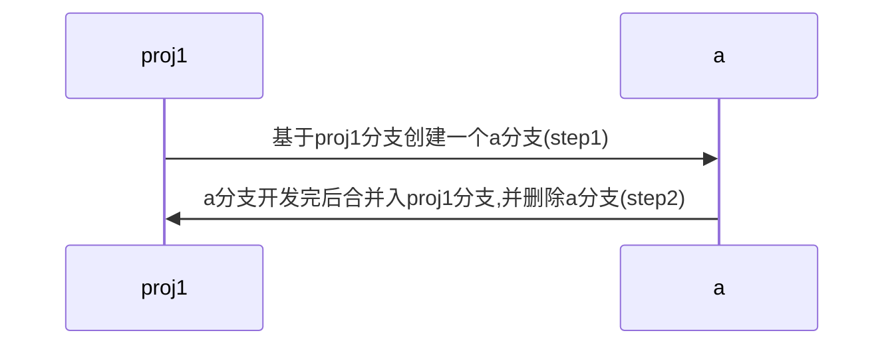

# git学习笔记


# git学习笔记
## git 缩写配置
- 在home目录创建.gitconfig文件复制粘贴以下配置并保存退出

```
[user]
name = xx
email = xx@qq.com
[color]
interactive = auto
diff = auto
status = auto
branch = auto
ui = true
repositoryformatversion = 0
filemode = true
bare = false
logallrefupdates = true
ignorecase = true
precomposeunicode = false

[alias]
co = checkout
ci = commit
st = status
sh = stash
sa = stash apply
sp = stash pop
ap = add -p
br = branch
cp = checkout -p
cv = commit -v
dc = diff --cached
d = diff
pr = pull --rebase
ps = push
l = log --graph --pretty=format:'%C(yellow)%h%Creset %C(yellow)%d%Creset %s %Cgreen(%cr) %C(bold blue)<%an>%Creset' --abbrev-commit --date=short --all
lg = log --color --graph --pretty=format:'%Cred%h%Creset -%C(yellow)%d%Creset %s %Cgreen(%cr) %C(bold blue)<%an>%Creset' --abbrev-commit --all
[hub]
protocol = https
[diff]
tool = vimdiff
[core]
editor = vim
```

## 常用缩写
- git co


- git br


- git st


- git lg


## 工作流
1. 开发新功能a


```
step1:
git br a proj1
git push origin a

step2:
git co proj1
git pull
git co a
git merge proj1
git push

git co proj1
git merge a
git push
git br -D a
```

## 常用命令
- 删除远程分支a:
- 切换到本地其它分支,如master
```
git co master
```
- 删除远程分支
```
git push origin --delete a
```

- 修改远程分支地址
```
git remote -v
git remote rm origin
git remote add origin git@gitee.com:cfanzp/linux_note.git
```
- git添加多个远程分支地址
```
git remote add gitee git@gitee.com:cfanzp/linux_note.git
```
### git tag
命令                                | 作用
--                                  | --
git tag                             | 查看标签列表
git tag -l "v1.0*"                  | 模糊匹配查询
git tag --list "v0.0*"              | 模糊匹配查询
git tag -a v1.0 -m "my version 1.0" | 添加附注标签
git show v1.0                       | 查看标签相关信息
git tag -lw                         | 创建轻量标签，git show 不会看到额外标签信息
git tag -a v0.9 9fceb02             | 后期打标签
git push origin --tags              | 将标签推送到远端
git tag -d v1.0                     | 删除标签
git push origin --delete <tagname>  | 删除远端标签

### git stash
当自己代码写了一半了，突然需要切换分支，去修改一下另外一个分支的某个问题的时候怎么办?
可以将当前分支放入暂存
```
git stash
```

当其它分支修改完后，想回到之前的状态怎么办?先checkout原来的分支，然后恢复暂存
```
git stash pop
```

当自己发现暂存的代码没用了如何删除?
```
git stash drop
```

清空暂存的所有内容
```
git stash clear
```

查看暂存
```
git stash list
```

### git diff
命令                     | 作用
--                       | --
git diff                 | 查看差异
git diff cached          | 查看工作版本和暂存的差异
git diff HEAD            | 查看工作版本和HEAD的差异
git diff HEAD^ HEAD      | 查看上上个版本和HEAD的差异
git diff --stat          | 查看差异的文件列表
git diff --stat ./client | 查看client目录 差异的文件列表
git diff > patch         | 使用git diff 打补丁
git apply --check patch  | 使用补丁,没有任何输出表示可以顺利接受这个补丁
git apply --reject patch | 使用补丁,冲突会生成.rej文件

### git 回退到某个版本
1. git reset commit-id
2. git push origin branch-name --force


### 远程分支更新
1. git remote update origin --prune
## 删除所有历史commit,创建一个新仓库
1. Checkout
```
git checkout --orphan latest_branch
```

2. Add all the files
```
git add -A
```

3. Commit the changes
```
git commit -am "commit message"
```

4. Delete the branch
```
git branch -D master
```

5. Rename the current branch to master
```
git branch -m master
```

6. Finally, force update your repository
```
git push -f origin master
```


---

> 作者: cfanzp  
> URL: http://111.230.8.71:8889/git-base/  

