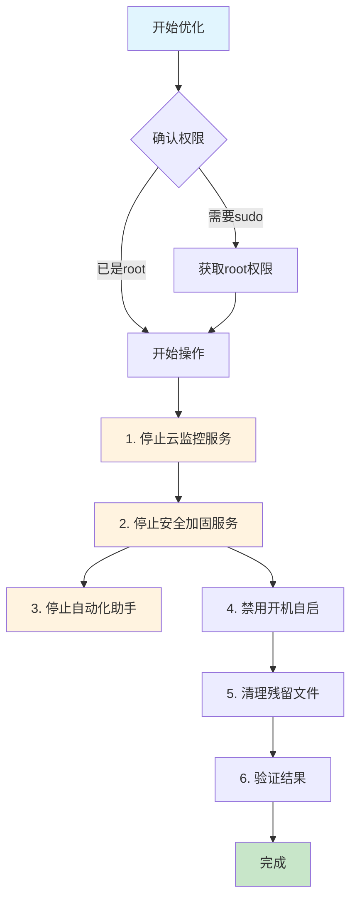
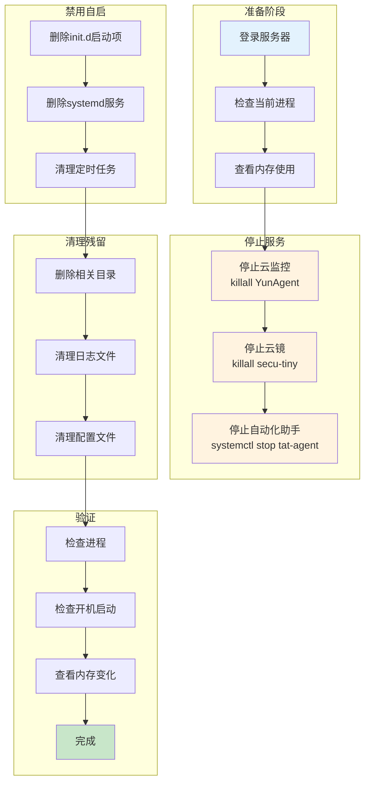

# 小内存腾讯云服务器优化：关闭安全加固、云监控与自动化助手


# 小内存腾讯云服务器优化：关闭安全加固、云监控与自动化助手

## 背景简介

腾讯云服务器默认会安装多种监控和安全组件，包括云监控（Cloud Monitor）、云镜（Security Agent）、安全加固和自动化助手（TAT）等。这些组件在后台持续运行，会占用一定的系统资源（CPU、内存）。

对于小内存服务器（如 1GB 或 2GB 内存）来说，这些后台服务可能会影响业务程序的可用内存，甚至导致 OOM（内存耗尽）问题。

**优化目标：**
- 释放内存资源
- 减少后台进程占用
- 提升服务器响应速度
- 降低资源消耗

## 需要关闭的组件

| 组件名称 | 功能 | 占用资源 |
|---------|------|---------|
| 云监控（YunAgent） | 监控服务器性能指标 | 约 50-100MB 内存 |
| 云镜（Security Agent） | 安全防护和病毒扫描 | 约 30-80MB 内存 |
| 安全加固（Security hardening） | 系统安全加固 | 约 20-50MB 内存 |
| 自动化助手（TAT） | 远程运维自动化 | 约 10-30MB 内存 |

## 思维导图：操作流程总览



## 详细操作步骤

### 步骤 1：检查当前运行的组件

首先查看服务器上安装了哪些腾讯云组件：

```bash
# 查看系统进程
ps aux | grep -E 'qcloud|YunAgent|secu-tiny|sa-agent|tat'

# 查看定时任务
crontab -l

# 查看 systemd 服务
systemctl list-units --type=service | grep -E 'qcloud|YunAgent|secu'

# 查看云监控进程
ls -la /usr/local/qcloud/
```

常见的进程和服务名：
- `YunAgent` - 云监控主进程
- `secu-tiny` - 云镜安全组件
- `sa-agent` - 安全代理
- `tat-agent` - 自动化助手

### 步骤 2：停止云监控服务

```bash
# 停止云监控主进程
sudo killall -YunAgent

# 或者使用进程ID停止
ps aux | grep YunAgent
sudo kill <PID>

# 停止云监控相关服务
sudo systemctl stop YunAgent
sudo systemctl disable YunAgent

# 停止 barad_agent（监控代理）
sudo killall -9 barad_agent
sudo systemctl stop barad_agent
sudo systemctl disable barad_agent
```

### 步骤 3：停止安全加固服务

```bash
# 停止云镜/安全组件
sudo killall -9 secu-tiny

# 停止安全防护服务
sudo systemctl stop security-agent
sudo systemctl disable security-agent

# 查找并停止相关进程
ps aux | grep -E 'secu|security'
sudo killall -9 <进程名>
```

### 步骤 4：停止自动化助手

```bash
# 停止自动化助手服务
sudo systemctl stop tat-agent
sudo systemctl disable tat-agent

# 停止进程
sudo killall -9 tat-agent

# 清理相关文件
sudo rm -f /usr/local/qcloud/tat-agent/
```

### 步骤 5：禁用开机自启

```bash
# 移除开机启动项
sudo rm -f /etc/init.d/qcloud-init
sudo rm -f /etc/init.d/YunAgent
sudo rm -f /etc/init.d/secu-tiny

# 清理 systemd 启动文件
sudo rm -f /etc/systemd/system/qcloud*.service
sudo rm -f /etc/systemd/system/yunagent*.service

# 重新加载 systemd
sudo systemctl daemon-reload
```

### 步骤 6：清理残留文件和定时任务

```bash
# 查看并清理定时任务
crontab -l

# 移除腾讯云相关定时任务
sudo crontab -l | grep -v 'qcloud\|YunAgent\|secu\|tat' | sudo crontab -

# 或者直接编辑
sudo crontab -e
# 删除包含以下关键词的行：
# qcloud, YunAgent, secus, tat, stargate

# 清理相关目录
sudo rm -rf /usr/local/qcloud/
sudo rm -rf /var/lib/qcloud/
sudo rm -rf /var/log/qcloud/
```

### 步骤 7：验证优化效果

```bash
# 检查进程是否已停止
ps aux | grep -E 'qcloud|YunAgent|secu-tiny|sa-agent|tat'

# 检查开机自启
systemctl list-units --type=service | grep -E 'qcloud|YunAgent'

# 查看内存使用情况
free -h

# 对比优化前后内存
# 优化前: 
#               total        used        free      shared  buff/cache   available
# Mem:          1.9Gi       800Mi       100Mi        10Mi       980Mi       900Mi
# Swap:         100Mi       50Mi        50Mi

# 优化后:
#               total        used        free      shared  buff/cache   available
# Mem:          1.9Gi       400Mi       500Mi        10Mi       980Mi       1.3Gi
# Swap:         100Mi       10Mi        90Mi
```

## 详细操作流程图（Mermaid）



## 注意事项

### 风险提示

1. **监控功能丧失**：关闭云监控后，将无法在腾讯云控制台查看该服务器的监控数据
2. **安全功能丧失**：关闭云镜后，将失去部分安全防护能力
3. **自动化功能丧失**：关闭自动化助手后，将无法使用腾讯云的远程运维功能

**重要：** 如果服务器用于重要业务，请评估风险后再操作。

### 适用场景

**推荐关闭：**
- 个人学习服务器
- 小内存开发测试环境
- 对监控需求不高的内网服务器
- 资源紧张的低配置服务器

**不建议关闭：**
- 生产环境服务器（需要监控告警）
- 对安全要求高的服务器
- 需要使用腾讯云运维功能的服务器

### 后续如果需要恢复

```bash
# 重新安装云监控
wget https://winscp-netdisk-1259698749.cos.ap-guangzhou.myqcloud.com/backup/yunagent/install.sh
sudo bash install.sh

# 重启服务器后自动恢复
sudo reboot
```

## 常见问题

### Q: 关闭后会影响服务器正常使用吗？

A: 不会影响业务程序运行，只是无法在腾讯云控制台查看监控数据和部分运维功能。

### Q: 关闭后能节省多少内存？

A: 根据服务器配置不同，大约可以释放 100-300MB 内存。

### Q: 云监控可以只关闭部分功能吗？

A: 可以的，云监控的各个组件是独立的，可以选择性关闭不需要的部分。

### Q: 关闭后云服务器会被腾讯云回收吗？

A: 不会，监控只是辅助功能，关闭不会影响服务器正常运行。

### Q: 如何确认所有组件都已关闭？

```bash
# 检查所有可能残留的进程
ps -ef | grep -E 'qcloud|YunAgent|secu|tat|stargate'

# 检查所有可能的服务
systemctl list-all-units | grep -E 'qcloud|YunAgent|tat'

# 检查所有可能的定时任务
sudo crontab -l
sudo cat /etc/crontab
ls -la /etc/cron.d/
```

## 总结

对于小内存腾讯云服务器，关闭云监控、云镜和自动化助手可以有效释放系统资源，提升服务器性能。

**优化效果：**
- 释放 100-300MB 内存
- 减少后台进程 CPU 占用
- 降低系统负载

**操作要点：**
1. 按顺序停止各个服务
2. 禁用开机自启动
3. 清理残留文件和定时任务
4. 验证优化效果

根据实际需求选择是否关闭，如需保留监控功能，可以只关闭部分不需要的组件。

## 参考命令汇总

```bash
# 停止所有腾讯云组件
sudo killall -9 YunAgent secu-tiny tat-agent barad_agent 2>/dev/null

# 禁用所有服务
sudo systemctl disable YunAgent barad_agent security-agent tat-agent 2>/dev/null

# 清理目录
sudo rm -rf /usr/local/qcloud/

# 清理定时任务
sudo crontab -l | grep -v 'qcloud\|YunAgent\|secu\|tat' | sudo crontab -
```

---

> 作者: [](https://cfanzp008.github.io/about/)  
> URL: https://cfanzp008.github.io/tencent-cloud-server-optimization/  

